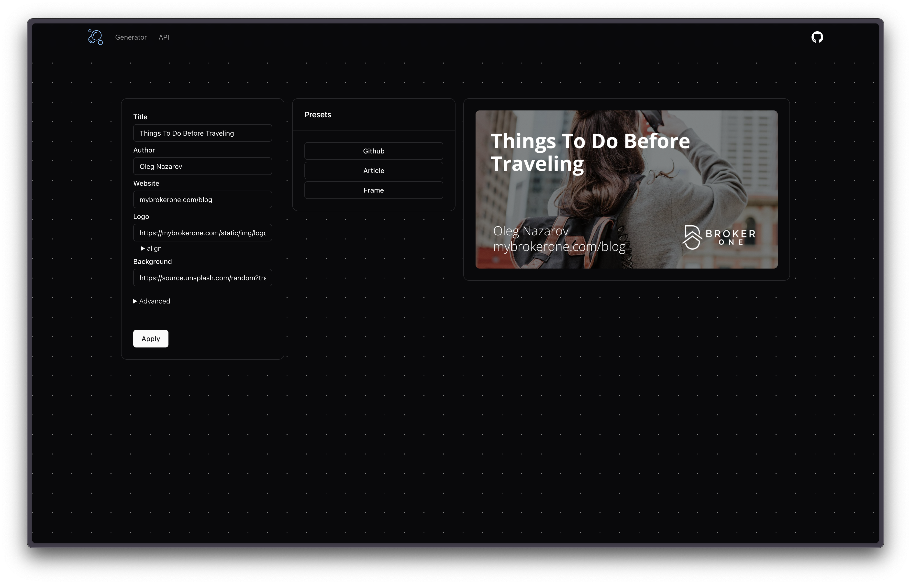

<p align="center">
    
</p>

<h1 align="center">oxigen</h1>

<p align="center">
    Social media image generator
</p>

```go
docker run -d -p 80:80 ghcr.io/yznts/oxigen:latest
```

Oxigen is a dynamic social media image generator, which gives you an ability to easily create, customize and use og images with both UI and API.


