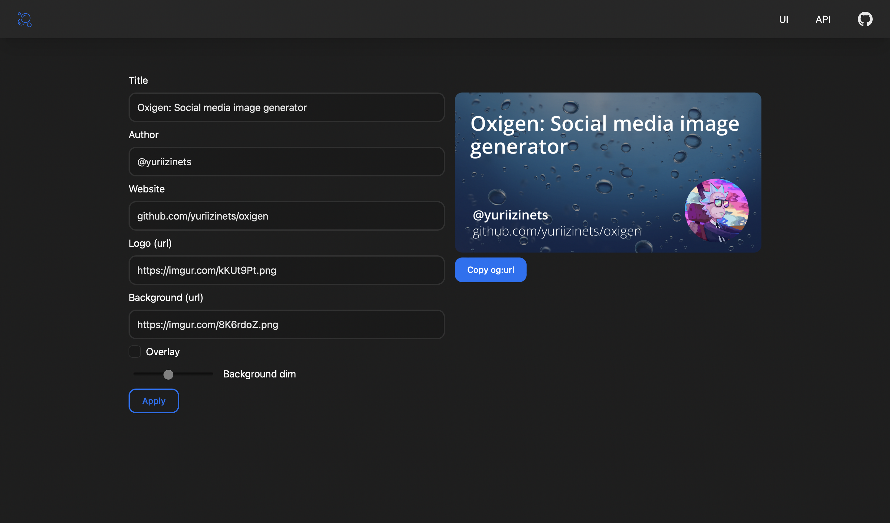

<p align="center">
  <a href="https://getdoks.org/">
    
  </a>
</p>

<h1 align="center">
  Oxigen
</h1>

<h3 align="center">
  Social media image generator
</h3>

<p align="center">
  Oxigen is a dynamic social media image generator, which gives you an ability to easily create, customize and use og images with both UI and API.
</p>

<p align="center">
  
</p>

## Installation

You have at least 3 options to install and run oxigen.

### Docker way

Please note, you need Docker installed on your system.
To use dockerized oxigen, it's enough to create and run a container with an existing image.

```bash
docker run ghcr.io/yuriizinets/oxigen:latest -p 80:80
```

> !!! It's highly recommended to use explicit version instead of `latest`

### Binary way

> Temporary not working (see a discussion here https://github.com/yuriizinets/oxigen/issues/5)
> Use a docker image instead

First, you need to download and unpack latest [release](https://github.com/yuriizinets/oxigen/releases/tag/1.3) 
with corresponding OS and architecture.
After this, it's enough just to run oxigen.

```bash
./oxigen
```

Optionaly, you can move binary to your bin folder (f.e. `mv oxigen /usr/local/bin/`)

### Go way

> Temporary not working (see a discussion here https://github.com/yuriizinets/oxigen/issues/5)
> Use a docker image instead

In case you have go binaries folder in your PATH, you can get, build and install oxigen by your own.

```bash
go install github.com/yuriizinets/oxigen@latest
```

After that, oxigen will be available globally.

```bash
oxigen
```
